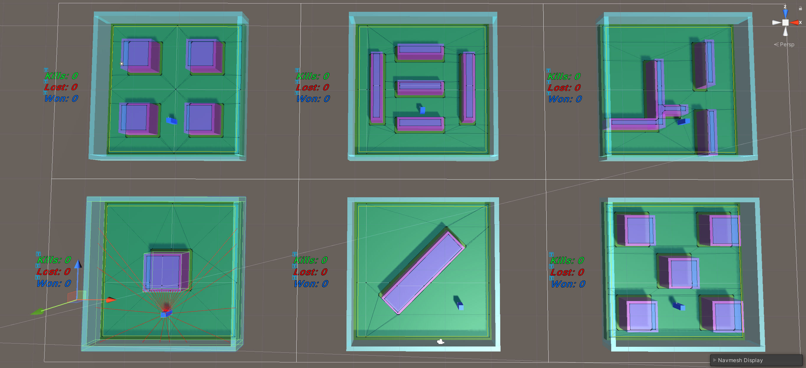
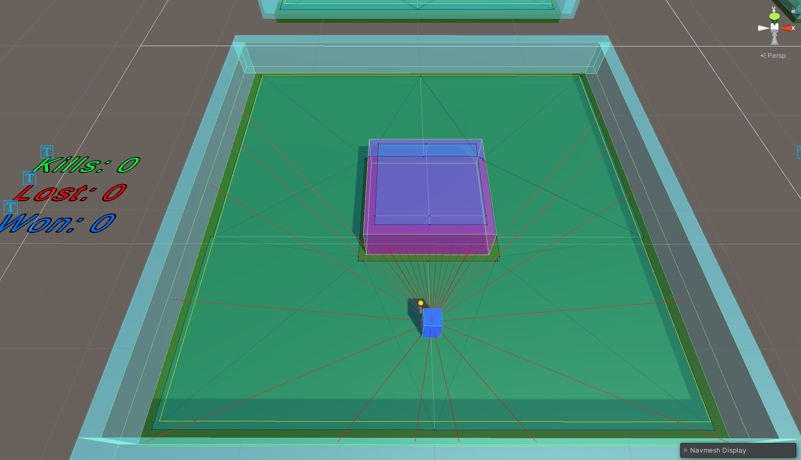
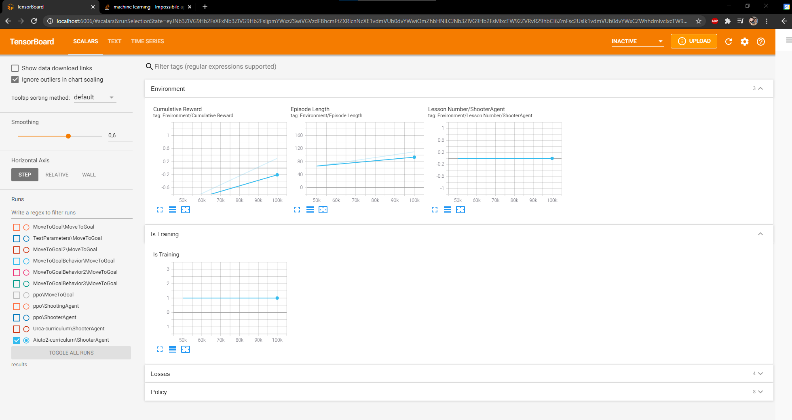

<h1 align="center">🧠 Reinforcement Learning Shooter Agent</h1>

<p align="center">
  <strong>A Unity ML-Agents experiment in which a PPO agent learns to survive and fight in increasingly difficult combat arenas.</strong><br>
  Ray-based perception, reward shaping, parallel environments, curriculum learning, NavMesh opponents, and ONNX inference.
</p>

<p align="center">
  
</p>

<p align="center">
  
  
  
  
  
</p>

## 📌 Project Snapshot

| | |
|---|---|
| **Role** | Solo developer and ML experiment designer |
| **Engine** | Unity 2020.2.5f1 |
| **Language** | C# |
| **Framework** | Unity ML-Agents 1.0.7 / ML-Agents Release 10 |
| **Training** | Proximal Policy Optimization (PPO), curiosity, curriculum learning |
| **Development** | 2021 academic specialization / thesis project |
| **Status** | Completed academic experiment; archived portfolio copy |

## 🎮 Overview

*Reinforcement Learning Shooter Agent* is my final academic specialization project exploring how a game agent can learn a combat loop through reinforcement learning rather than a hand-authored behaviour tree or state machine.

The agent must move, aim, decide when to shoot, avoid pursuing enemies, and eliminate every opponent in an arena. Training runs across several parallel arenas with different obstacle layouts. A curriculum increases the number and movement speed of enemies as performance improves, gradually raising the difficulty instead of exposing the policy to the hardest scenario immediately.

The repository also preserves the smaller Move-to-Goal and Penguins exercises that preceded the shooter experiment. The shooter environment, training configuration, gameplay systems, curriculum, trained ONNX policy, and evaluation scene form the thesis deliverable.

## 👨‍💻 What I Built

- Designed and implemented the **shooter-agent environment** in Unity and connected it to the ML-Agents lifecycle.
- Defined the agent's movement, rotation, shooting actions, episode reset flow, and inference behaviour.
- Combined vector observations with two **ray-perception sensors** that detect enemies and walls around the agent.
- Designed the reward model: a small time penalty encourages efficiency, missed shots are penalized, kills are rewarded, and contact with an enemy ends the episode with a negative reward.
- Implemented enemy health, damage, death, respawn, pursuit, and randomized placement on valid NavMesh positions.
- Built an enemy manager that changes the active opponent count and detects when the agent has cleared a wave.
- Created multiple arena layouts and used parallel instances to collect experience more efficiently.
- Configured **PPO training**, a curiosity reward signal, network settings, time horizon, batch and buffer sizes, and maximum training steps.
- Implemented curriculum parameters that raise active enemies from **2 to 5** and enemy speed from **1.2 to 1.8** as the policy reaches reward thresholds.
- Exported and integrated trained **ONNX models** for inference directly inside the Unity scene.
- Tracked kills, losses, wins, cumulative reward, episode length, and curriculum progression during experimentation.

## ⚙️ Technical Highlights

### Perception and action space

The agent receives its current rotation and weapon-cooldown state as vector observations. Two child ray sensors cover the forward firing area and the wider side/rear space, classifying hits as walls or enemies. Its actions control firing, forward/back movement, and rotation.

<p align="center">
  
</p>

### Reward shaping and episodes

Each physics step applies a small negative reward to discourage passive survival. A missed shot adds a further penalty, while eliminating an enemy produces a positive reward. Enemy contact applies a loss penalty and ends the episode; clearing the active wave also completes the episode. Every reset restores the agent and refreshes the current curriculum parameters.

### Curriculum-driven difficulty

The training configuration exposes enemy count and speed as environment parameters. Successive lessons increase both values after the smoothed reward passes a threshold, allowing the policy to learn the basic combat loop before facing denser and faster pursuit.

### Dynamic enemy environment

Enemies use Unity NavMesh navigation to chase the agent. They are pooled within the environment, activated according to the current lesson, and repositioned by sampling valid NavMesh locations. Multiple obstacle layouts test whether the learned policy generalizes beyond one fixed arena.

### Training and inference pipeline

The historical setup used PPO with three 512-unit hidden layers, extrinsic rewards, a curiosity signal, and a 500,000-step limit. Training output was inspected with TensorBoard, then the selected policy was exported to ONNX and assigned to the scene for local inference.

<p align="center">
  
</p>

## ✨ Project Features

- Reinforcement-learning combat agent with movement, aiming, and shooting.
- PPO training with extrinsic and curiosity reward signals.
- Curriculum learning for enemy count and movement speed.
- Parallel training arenas with different obstacle configurations.
- Forward and peripheral ray-based perception of enemies and walls.
- NavMesh-driven pursuing enemies with randomized valid respawns.
- Reward shaping for efficiency, accuracy, kills, and survival.
- Wave completion, episode reset, and runtime score counters.
- Included trained ONNX policies for immediate inference.
- Preliminary Move-to-Goal and Penguins learning exercises retained as development context.

## 🛠️ Technology

- Unity 2020.2.5f1
- C#
- Unity ML-Agents 1.0.7
- ML-Agents Release 10 with Python 3.7.9
- PyTorch 1.7
- PPO and curiosity reward signals
- Curriculum learning and environment parameters
- Unity NavMesh
- Ray Perception Sensor 3D
- ONNX inference
- TensorBoard
- TextMesh Pro

## 🎬 Media

- [Thesis and training showcase](https://www.youtube.com/watch?v=rLb58odh8Fg)

The video is a complete academic demonstration of the project, covering the training process, curriculum progression, and the agent running in Unity.

## 🚀 Running the Project

### Run the trained policy

1. Install Unity **2020.2.5f1** through Unity Hub.
2. Clone this repository.
3. Open the repository root as a Unity project and allow Package Manager to restore the recorded dependencies.
4. Open `Assets/Shooter/Scene/ShooterScene.unity`.
5. Enter Play Mode. The scene already references the included curriculum-trained ONNX model.

### Retrain the agent

The historical training environment used Python **3.7.9**, PyTorch **1.7**, and ML-Agents **Release 10**. Recreate those versions in a fresh virtual environment rather than using the original machine-specific environment.

With the compatible Python packages installed, start training from the project root with:

```powershell
mlagents-learn config/training_configNew_curriculum.yaml --run-id=ShooterAgent
```

When the command is ready, enter Play Mode in Unity. Training output is written to `results/`, which is intentionally ignored because it can be regenerated. Selected ONNX policies used by the Unity project remain versioned under `Assets/Shooter/Brain/`.

Generated Unity folders, the historical Python virtual environment, IDE settings, and redundant intermediate training checkpoints were removed from the portfolio history. The original 2021 development progression and all project files required for Unity inference or renewed training were preserved.

## 🧭 Project Context

- **Context:** Individual final-year academic specialization / thesis
- **Focus:** Applying reinforcement learning to a gameplay-combat problem
- **My position:** Sole developer of the shooter experiment and training environment
- **Repository history:** Original progressive development history preserved; later portfolio migration changes identified separately
- **Archive:** The historical project, configurations, selected trained models, and thesis media remain backed up locally

## 👥 Credits, Ownership and Status

The shooter experiment was developed by Christopher Bonetto using Unity ML-Agents. The repository also contains introductory learning exercises and Unity/ML-Agents components whose original rights remain with their respective authors.

> This repository is shared for portfolio review and educational demonstration. It documents an academic machine-learning experiment and is not presented as a production-ready AI framework or an open-source asset release.

**Project status:** Completed 2021 academic project; preserved for portfolio review and no longer actively maintained.

## 💼 Contact

[LinkedIn — Christopher Bonetto](https://www.linkedin.com/in/christopher-bonetto-547876221)
